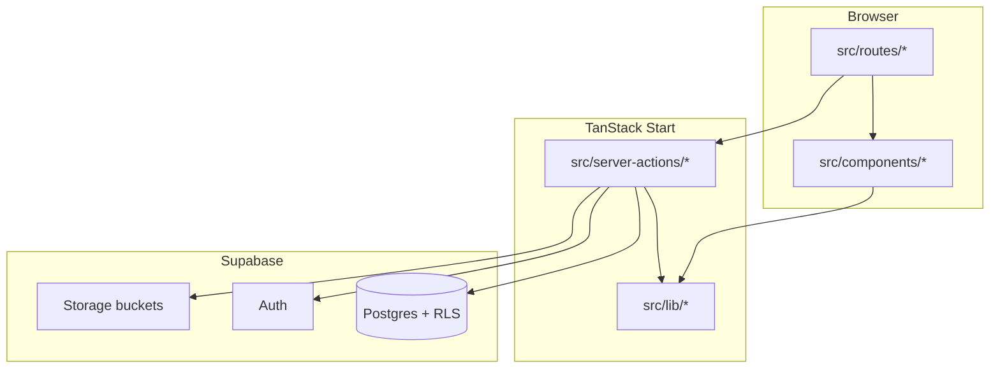
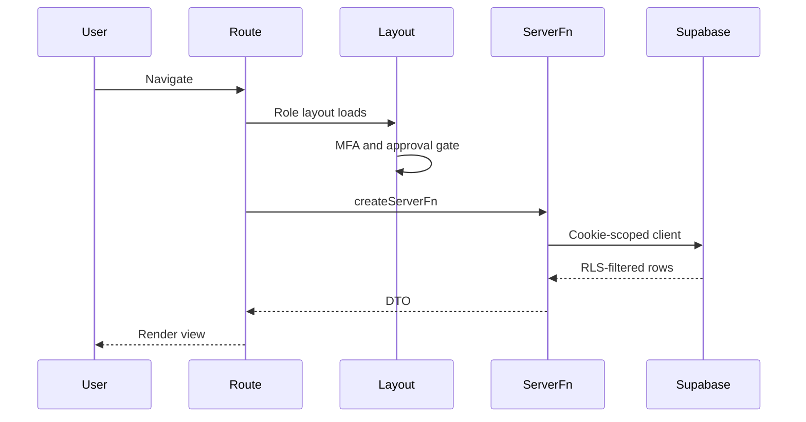
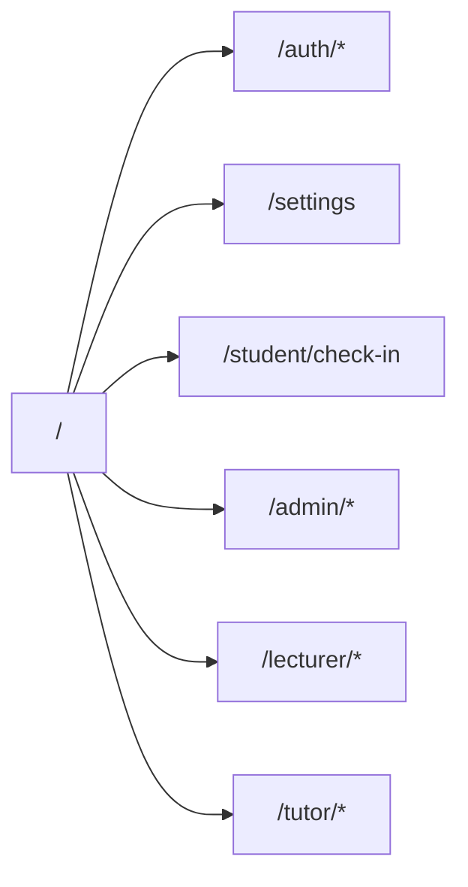
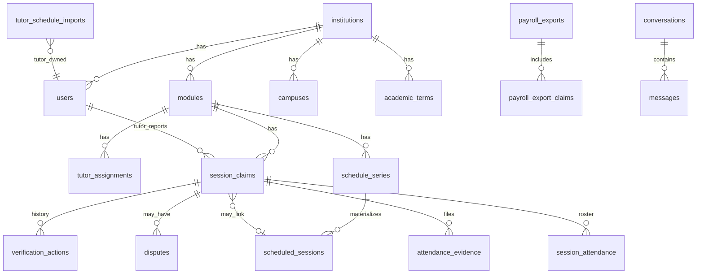
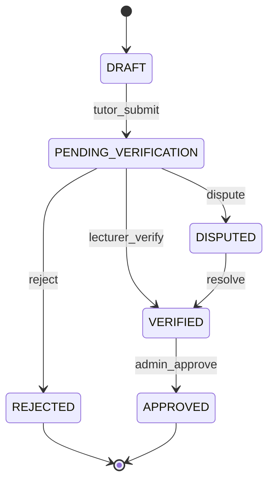
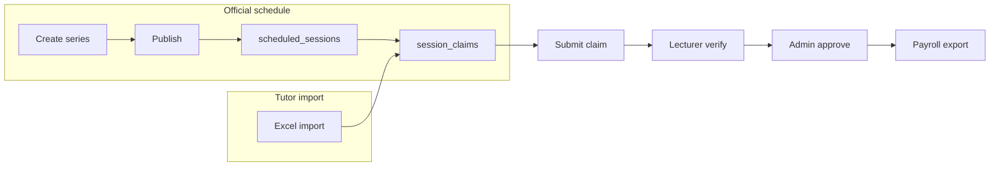

# Architecture & file structure

Emeris tutoring operations platform: institution scheduling, tutor session claims, lecturer verification, attendance, payroll export, and messaging. This document describes how the codebase is organized and what each dashboard can do.

---

## Table of contents

1. [Introduction](#1-introduction)
2. [System architecture](#2-system-architecture)
3. [Request and auth flow](#3-request-and-auth-flow)
4. [Repository file structure](#4-repository-file-structure)
5. [Routing map](#5-routing-map)
6. [Core data model](#6-core-data-model)
7. [Session claim lifecycle](#7-session-claim-lifecycle)
8. [Features by dashboard](#8-features-by-dashboard)
   - [Admin](#admin-dashboard-admin)
   - [Lecturer](#lecturer-dashboard-lecturer)
   - [Tutor](#tutor-dashboard-tutor)
   - [Student](#student-no-dashboard)
   - [Auth and settings](#shared-auth-and-settings)
9. [Cross-cutting features](#9-cross-cutting-features)
10. [Local development](#10-local-development)

---

## 1. Introduction

### Product scope

| Area | Description |
|------|-------------|
| **Scheduling** | Recurring tutorial series, materialized sessions, venues, change requests |
| **Session claims** | Tutors report delivered sessions; structured notes and attendance |
| **Verification** | Lecturers verify, dispute, or reject claims |
| **Approval & payroll** | Admins approve verified claims and export payroll batches |
| **Attendance** | QR check-in, registers, roster, integrity checks |
| **Messaging** | Direct and workflow-linked conversations |
| **Institution admin** | Users, invites, onboarding, campuses, terms, modules, audit logs |

### Tech stack

| Layer | Technology |
|-------|------------|
| **UI** | React 19, TanStack Router, TanStack Start (SSR) |
| **Build** | Vite 8, TypeScript |
| **Styling** | Tailwind CSS 4, Radix UI / shadcn (`src/components/ui/`) |
| **Motion & charts** | Framer Motion, Recharts, `@dnd-kit` |
| **Forms** | React Hook Form, Zod |
| **Backend** | Supabase (Postgres, Auth, Storage, RLS) |
| **API shape** | TanStack `createServerFn` in `src/server-actions/` |

Routes are **thin**: they load data, wire handlers, and render feature views. Business rules live in **server actions**; Postgres **RLS** enforces tenancy and role access even if a handler is wrong.

### Roles

Defined in `src/lib/user-role.ts` and mirrored in Postgres `user_role`:

| Role | Dashboard entry |
|------|-----------------|
| `TUTOR` | `/tutor` |
| `LECTURER` | `/lecturer` |
| `ADMIN`, `SUPER_ADMIN` | `/admin` |

There is **no student role** and no student login. Students use a **public check-in page** with a session token.

Unauthenticated users go to `/auth/login`. Users without a mapped role land on `/settings`.

---

## 2. System architecture



**Layers:**

- **`src/routes/`** — File-based URLs; layout routes gate by role, MFA, and onboarding approval.
- **`src/components/`** — Feature UI grouped by role (`admin/`, `lecturer/`, `tutor/`) plus shared `messaging/`, `settings/`, `ui/`.
- **`src/server-actions/`** — One folder per domain; each exports `*Fn` handlers validated with Zod.
- **`src/lib/`** — Supabase clients, `requireAdminContext` / `requireLecturerId`, schedule math, claim display, exports.
- **`supabase/migrations/`** — Schema, enums, RLS policies, triggers (e.g. claim status audit).

Imports use the `#/` alias (see `tsconfig` paths).

---

## 3. Request and auth flow



**Key files:**

| Step | Location |
|------|----------|
| Root session | `src/routes/__root.tsx` — `getCurrentUserFn` loader |
| Role redirect | `src/routes/index.tsx` — `getPostAuthDashboardPath` |
| Admin gate | `src/routes/admin/route.tsx` — `AdminAppShell` |
| Lecturer gate | `src/routes/lecturer/route.tsx` — `LecturerAppShell` |
| Tutor gate | `src/routes/tutor/route.tsx` — `TutorAppShell` |
| MFA | `src/lib/mfa-auth.ts`, `src/routes/auth/mfa.tsx` |
| Onboarding approval | `src/lib/user-approval-gate.ts` |
| Invite signup | `src/lib/auth-server.ts`, `src/routes/auth/register.tsx` |

Dashboard layouts hide the marketing top nav from `__root.tsx` and use a full-height sidebar shell (`src/components/app-shell.tsx`).

---

## 4. Repository file structure

### Top-level layout

```
tutoring_system/
├── docs/                    # Project documentation (this file)
├── src/
│   ├── routes/              # TanStack Router file routes
│   ├── components/          # React UI by feature and role
│   ├── server-actions/      # Server functions (API layer)
│   ├── lib/                 # Shared utilities and Supabase clients
│   ├── styles.css           # Global CSS and design tokens
│   └── routeTree.gen.ts     # Generated route tree (do not edit by hand)
├── supabase/
│   └── migrations/          # SQL migrations (schema + RLS)
├── package.json
├── vite.config.ts
└── .env.local               # Supabase URL and keys (not committed)
```

### `src/components/` (by area)

| Folder | Purpose |
|--------|---------|
| `ui/` | shadcn primitives: Button, Card, Sheet, Table, ScrollArea, etc. |
| `admin/` | Admin dashboard, approvals, institutions, users, schedules, sessions, analytics, audit |
| `lecturer/` | Schedule calendar, verification, sessions, tutors, attendance, analytics, reports |
| `tutor/` | Sessions workspace, claims, schedules import, register generation, dashboard |
| `messaging/` | Conversation sidebar, chat window, workflow message buttons, realtime listener |
| `settings/` | Account, security, notifications, onboarding documents |
| `*-app-shell.tsx` | Role sidebars wrapping `AppShell` |
| `app-shell.tsx` | Shared sidebar layout, user menu, settings link |

### `src/server-actions/` (23 domains)

| Folder | Primary actor | Responsibility |
|--------|---------------|----------------|
| `admin-dashboard/` | Admin | Institution KPIs, feed, deadlines, payroll readiness |
| `admin-analytics/` | Admin | Cross-institution analytics |
| `admin-users/` | Admin | Users, invites, onboarding review, MFA reset, provisioning |
| `admin-institutions/` | Admin | Profile, campuses, academic terms, modules |
| `admin-schedules/` | Admin | Calendar, series CRUD, publish/archive/delete, conflicts, change requests |
| `admin-sessions/` | Admin | Session list, summary, read-only detail |
| `admin-approvals/` | Admin | Approve/reject verified claims, payroll export |
| `admin-audit-logs/` | Admin | Paginated institution audit feed |
| `lecturer-dashboard/` | Lecturer | Pending claims, activity, alerts |
| `lecturer-sessions/` | Lecturer | Module sessions list and detail |
| `lecturer-verification/` | Lecturer | Verification queue actions |
| `lecturer-schedule/` | Lecturer | Series, venues, publish, exceptions, reschedule |
| `lecturer-tutors/` | Lecturer | Tutor roster and module assignment |
| `lecturer-attendance/` | Lecturer | Attendance dashboard and integrity |
| `lecturer-analytics/` | Lecturer | Charts and KPIs |
| `lecturer-reports/` | Lecturer | Report catalog and export |
| `tutor-dashboard/` | Tutor | Stats, chart series, notifications |
| `tutor-sessions/` | Tutor | Claims hub: Kanban, submit, evidence, QR, roster |
| `tutor-schedule/` | Tutor | Spreadsheet schedule imports |
| `tutor-assigned-schedule/` | Tutor | Official `scheduled_sessions` for assigned tutor |
| `tutor-notes/` | Tutor | Structured notes on claims |
| `messaging/` | All roles | Conversations, messages, admin notices |
| `settings/` | All roles | Profile, preferences, avatar, security |

### `src/lib/` (selected)

| Module | Role |
|--------|------|
| `supabase-server.ts` | SSR Supabase client (cookies) |
| `supabase.ts` | Browser anon client |
| `supabase-admin.ts` | Service role for privileged ops |
| `admin-server.ts` / `lecturer-server.ts` | Role context helpers |
| `schedule-recurrence.ts`, `schedule-conflicts.ts` | Scheduling engine |
| `schedule-spreadsheet.ts` | Parse Excel timetables |
| `session-claim-display.ts`, `session-kanban-column.ts` | Claim UI helpers |
| `messaging-realtime.ts` | Realtime message subscriptions |
| `audit-log.ts` | Institution audit logging |
| `user-role.ts` | Role constants and dashboard paths |

### Conventions

From `.cursor/rules/codebase-maintenance.mdc`:

- Colocate feature code under the nearest route or `components/<feature>/`.
- One concern per server-action module; keep types next to handlers.
- Reuse `src/components/ui/` before adding new primitives.
- Do not extract shared abstractions until a second real call site exists.

---

## 5. Routing map



### Global routes

| Path | Route file | Shell / layout |
|------|------------|----------------|
| `/` | `src/routes/index.tsx` | Redirect to role dashboard or login |
| `/settings/` | `src/routes/settings/index.tsx` | Root nav (standalone settings) |
| `/student/check-in` | `src/routes/student/check-in.tsx` | Root nav (public) |

### Auth routes

| Path | Route file |
|------|------------|
| `/auth/login` | `src/routes/auth/login.tsx` |
| `/auth/register` | `src/routes/auth/register.tsx` |
| `/auth/mfa` | `src/routes/auth/mfa.tsx` |
| `/auth/forgot-password` | `src/routes/auth/forgot-password.tsx` |
| `/auth/recover-password` | `src/routes/auth/recover-password.tsx` |

Auth pages use a dedicated layout (no dashboard shell).

### Route → shell summary

| Prefix | Layout | Shell component |
|--------|--------|-----------------|
| `/admin/*` | `src/routes/admin/route.tsx` | `AdminAppShell` |
| `/lecturer/*` | `src/routes/lecturer/route.tsx` | `LecturerAppShell` |
| `/tutor/*` | `src/routes/tutor/route.tsx` | `TutorAppShell` |

Each shell mounts `IncomingMessagesListener` for messaging realtime (`src/components/messaging/incoming-messages-listener.tsx`).

---

## 6. Core data model

Two scheduling paths feed the same **`session_claims`** workflow.



### Official schedule (lecturer / admin)

1. **`schedule_series`** — Recurring rule (`recurrence_json`), tutor, venue, status: `DRAFT` → `PUBLISHED` → `ARCHIVED`.
2. **`scheduled_sessions`** — Materialized occurrences (`SCHEDULED`, `CANCELLED`, `RESCHEDULED`).
3. **`session_claims`** — Linked via `source_scheduled_session_id` when a tutor runs a session.

Lifecycle helpers: `src/server-actions/lecturer-schedule/series-lifecycle.ts` (delete draft, archive published + cancel upcoming sessions).

### Tutor timetable import

1. **`tutor_schedule_imports`** — Parsed spreadsheet JSON.
2. Claims created or matched via fingerprints (`src/lib/schedule-event-fingerprint.ts`).

### Session claim (central entity)

| Related table | Purpose |
|---------------|---------|
| `verification_actions` | Audit trail of status changes |
| `disputes` | Lecturer/tutor disputes |
| `attendance_evidence` | Register file metadata (Storage paths) |
| `session_attendance` | Per-student check-in rows |
| `students` | Institution student records for roster/check-in |

### Tenancy

Almost all rows are scoped by **`institution_id`** (directly or via `modules`). RLS policies use helpers like `get_auth_user_institution_id()` and `is_module_in_auth_institution()`.

Schema source: `supabase/migrations/` (baseline `20260513041400_remote_schema.sql`, scheduling `20260526120000_lecturer_schedule_system.sql`, admin engine `20260603120000_admin_scheduling_engine.sql`, and follow-ups). For full table definitions, enums, RLS, and migration index, see **[DATABASE.md](./DATABASE.md)**.

---

## 7. Session claim lifecycle



| Status | Typical owner | Server actions |
|--------|---------------|----------------|
| `DRAFT` | Tutor | `tutor-sessions/` — create, edit, evidence, submit |
| `PENDING_VERIFICATION` | Lecturer | `lecturer-verification/` — verify, dispute, reject |
| `VERIFIED` | Admin | `admin-approvals/` — approve for payroll |
| `APPROVED` | — | Included in `payroll_exports` |
| `DISPUTED` / `REJECTED` | Lecturer / tutor | Resolution via verification and messaging |

Display helpers: `src/lib/session-claim-display.ts`. Tutor Kanban columns: `src/lib/session-kanban-column.ts`.

---

## 8. Features by dashboard

---

### Admin dashboard (`/admin`)

**Shell:** `src/components/admin-app-shell.tsx`  
**Layout:** `src/routes/admin/route.tsx`

#### Sidebar navigation

| Nav label | Path | Notes |
|-----------|------|-------|
| Dashboard | `/admin` | |
| Approvals | `/admin/approvals` | |
| Institutions | `/admin/institutions` | |
| Users | `/admin/users` | |
| Schedules | `/admin/schedules` | |
| Sessions | `/admin/sessions` | |
| Payment | `/admin/payements` | Nav typo; route file is `payments.tsx` → `/admin/payments` |
| Messaging | `/admin/messaging` | |
| Analytics | `/admin/analytics` | |
| Reports | `/admin/reports` | |
| Audit Logs | `/admin/audit-logs` | |

`/admin/settings` exists as a route but is **not** in the sidebar.

#### Routes and features

| Route | Route file | Main UI | Features |
|-------|------------|---------|----------|
| `/admin/` | `admin/index.tsx` | `admin-dashboard-view.tsx` | KPIs, institution feed, upcoming deadlines, payroll readiness, quick actions |
| `/admin/approvals` | `admin/approvals.tsx` | `admin-approvals-*` | Filter and approve/reject verified claims; payroll export bar |
| `/admin/institutions` | `admin/institutions.tsx` | `institution-management-view.tsx` | Institution profile, campuses, academic terms, modules |
| `/admin/users` | `admin/users.tsx` | `admin-users-table.tsx` | List users, roles, onboarding review, invites, MFA reset, provision users |
| `/admin/schedules` | `admin/schedules.tsx` | `admin-schedules-view.tsx` | Institution calendar; create/publish/archive/delete tutorial series; scheduling conflict cards; change-request review |
| `/admin/sessions` | `admin/sessions.tsx` | `admin-sessions-view.tsx` | Cross-institution session oversight; detail sheet (evidence, disputes, timeline) |
| `/admin/messaging` | `admin/messaging.tsx` | `admin-messaging-view.tsx` | Institution messaging and notices |
| `/admin/analytics` | `admin/analytics.tsx` | `admin-analytics-view.tsx` | Institution-wide analytics tables and summaries |
| `/admin/audit-logs` | `admin/audit-logs.tsx` | `admin-audit-logs-view.tsx` | Filterable audit feed |
| `/admin/payments` | `admin/payments.tsx` | Placeholder | **Not implemented** |
| `/admin/reports` | `admin/reports.tsx` | Placeholder | **Not implemented** |
| `/admin/settings` | `admin/settings.tsx` | Placeholder | **Not implemented** |

#### Server actions

`admin-dashboard/`, `admin-approvals/`, `admin-institutions/`, `admin-users/`, `admin-schedules/`, `admin-sessions/`, `admin-analytics/`, `admin-audit-logs/`, plus `messaging/admin-messaging.ts`.

---

### Lecturer dashboard (`/lecturer`)

**Shell:** `src/components/lecturer-app-shell.tsx`  
**Layout:** `src/routes/lecturer/route.tsx`

#### Sidebar navigation

| Nav label | Path |
|-----------|------|
| Dashboard | `/lecturer` |
| Verification Queue | `/lecturer/verification-queue` |
| Schedule | `/lecturer/schedule` |
| Sessions | `/lecturer/sessions` |
| Tutors | `/lecturer/tutors` |
| Attendance | `/lecturer/attendance` |
| Messages | `/lecturer/messages` |
| Analytics | `/lecturer/analytics` |
| Reports | `/lecturer/reports` |

#### Routes and features

| Route | Route file | Main UI | Features |
|-------|------------|---------|----------|
| `/lecturer/` | `lecturer/index.tsx` | `lecturer-dashboard-view.tsx` | Pending verification table, activity feed, modules, tutor activity, weekly sessions |
| `/lecturer/verification-queue` | `lecturer/verification-queue.tsx` | `verification-queue-view.tsx` | Review claims; verify, dispute, reject; detail sheet |
| `/lecturer/schedule` | `lecturer/schedule.tsx` | `lecturer-schedule-view.tsx` | Calendar (month/week/day/agenda); draft series (publish/delete); published series (archive); change requests |
| `/lecturer/sessions` | `lecturer/sessions.tsx` | Session list + `lecturer-session-detail-sheet.tsx` | Module sessions; cancelled rows; link to verification |
| `/lecturer/tutors` | `lecturer/tutors.tsx` | Tutor cards + `lecturer-tutor-detail-sheet.tsx` | Assign/remove tutors; invite; per-tutor stats |
| `/lecturer/attendance` | `lecturer/attendance.tsx` | Attendance views + `attendance-trend-chart.tsx` | KPIs, live snapshot, integrity issues |
| `/lecturer/messages` | `lecturer/messages.tsx` | Shared messaging components | Workflow threads on claims/sessions |
| `/lecturer/analytics` | `lecturer/analytics.tsx` | `lecturer-analytics-view.tsx` | Funnel, workload, claims volume charts |
| `/lecturer/reports` | `lecturer/reports.tsx` | `lecturer-reports-view.tsx` | Generate and export reports (JSON, CSV, XLSX, PDF) |

#### Server actions

`lecturer-dashboard/`, `lecturer-verification/`, `lecturer-schedule/`, `lecturer-sessions/`, `lecturer-tutors/`, `lecturer-attendance/`, `lecturer-analytics/`, `lecturer-reports/`, `messaging/`.

---

### Tutor dashboard (`/tutor`)

**Shell:** `src/components/tutor-app-shell.tsx` (help link → `/tutor/help`)  
**Layout:** `src/routes/tutor/route.tsx`

#### Sidebar navigation

| Nav label | Path |
|-----------|------|
| Dashboard | `/tutor` |
| Sessions | `/tutor/sessions` |
| Claims | `/tutor/claims` |
| Messaging | `/tutor/messaging` |
| Schedules | `/tutor/schedules` |
| Notes | `/tutor/notes` |
| Register generation | `/tutor/register-generation` |

Help is available via the shell footer (`helpPath`), not the main nav.

#### Routes and features

| Route | Route file | Main UI | Features |
|-------|------------|---------|----------|
| `/tutor/` | `tutor/index.tsx` | `tutor-dashboard-view.tsx` | Activity chart, stats, notifications, upcoming sessions, recent messages |
| `/tutor/sessions` | `tutor/sessions.tsx` | `tutor-sessions-workspace.tsx` | Kanban (today / upcoming / completed / claims pending); drag-reschedule; QR; evidence upload; filters; session detail |
| `/tutor/claims` | `tutor/claims.index.tsx` | `claims-dashboard.tsx` | Sortable claims table with status accents |
| `/tutor/claims/$claimId` | `tutor/claims.$claimId.tsx` | Claim detail page | Single-claim view |
| `/tutor/schedules` | `tutor/schedules.tsx` | `tutor-schedules-page.tsx` | Import Excel timetable; day view; link imports to claims |
| `/tutor/register-generation` | `tutor/register-generation.tsx` | `tutor-register-generation-page.tsx` | Live attendance register; analytics chart; export |
| `/tutor/notes` | `tutor/notes.tsx` | Notes UI | Topics, examples, struggles, revision fields on claims |
| `/tutor/messaging` | `tutor/messaging.tsx` | Messaging UI | Conversations with lecturers |
| `/tutor/help` | `tutor/help.tsx` | Help content | FAQ / guidance |

#### Server actions

`tutor-dashboard/`, `tutor-sessions/` (including `student-roster.ts`), `tutor-schedule/`, `tutor-assigned-schedule/`, `tutor-notes/`, `messaging/`.

#### Tutorial series (tutor context)

Tutors do **not** create `schedule_series`. They see official sessions via assignments and may import personal timetables. Series management is on **lecturer** and **admin** schedule pages.

---

### Student (no dashboard)

| Route | Route file | Features |
|-------|------------|----------|
| `/student/check-in` | `student/check-in.tsx` | Public form: `?token=` and `?session=`; name, student number, optional email; calls server check-in |

No app shell, no auth role.

---

### Shared: Auth and settings

| Area | Routes | Purpose |
|------|--------|---------|
| **Auth** | `/auth/login`, `register`, `mfa`, `forgot-password`, `recover-password` | Sign-in, invite-based registration, MFA, password recovery |
| **Settings** | `/settings` | Profile, security, notifications, onboarding document upload (also used when approval is pending) |

Server: `src/lib/auth-server.ts`, `src/server-actions/settings/`.

---

## 9. Cross-cutting features

### Messaging

- **UI:** `src/components/messaging/` — `ConversationSidebar`, `ChatWindow`, `NewConversationDialog`, `workflow-message-button.tsx`
- **API:** `src/server-actions/messaging/` — list conversations, send messages, pins, search, workflow metadata
- **Realtime:** `src/lib/messaging-realtime.ts` + `IncomingMessagesListener` in each dashboard shell

Workflow conversations can attach to claims, sessions, attendance, or disputes.

### Scheduling engine

Shared by lecturer and admin:

| Piece | Location |
|-------|----------|
| Materialize occurrences | `lecturer-schedule/materialize-series.ts` |
| Publish / archive / delete series | `publish-schedule-series.ts`, `series-lifecycle.ts`, admin mirrors |
| Conflict detection | `src/lib/schedule-conflicts.ts`, `admin-schedules/detect-scheduling-issues.ts` |
| Calendar UI | `src/components/lecturer/schedule/*` (reused by `admin-schedules-view.tsx`) |

### Attendance and QR

- Tutor: QR generation in sessions workspace; register upload; `register-generation` page
- Student: public check-in route
- Lecturer: attendance dashboard and integrity checks
- Storage bucket: attendance registers (paths on `attendance_evidence`)

### Audit and notifications

- **Audit:** `audit_logs` table; admin feed; `logInstitutionAudit()` for admin schedule events
- **Notifications:** `notifications` table; tutor dashboard preview

### End-to-end flows



---

## 10. Local development

```bash
npm install
npm run dev      # http://localhost:3000
npm run build    # production build
npm run test     # Vitest
```

**Environment:** create `.env.local` with Supabase project URL and anon key (and service role where required for local admin flows). Do not commit secrets.

**Import alias:** use `#/components/...`, `#/lib/...`, `#/server-actions/...` from `src/`.

**Generated files:** `src/routeTree.gen.ts` is produced by TanStack Router; regenerate via dev/build when adding routes.

---

## Related documentation

- [DATABASE.md](./DATABASE.md) — Postgres schema, enums, RLS, storage, migrations
- Code maintenance conventions: `.cursor/rules/codebase-maintenance.mdc`
- Avoid premature abstraction: `.cursor/rules/avoid-premature-abstraction.mdc`
