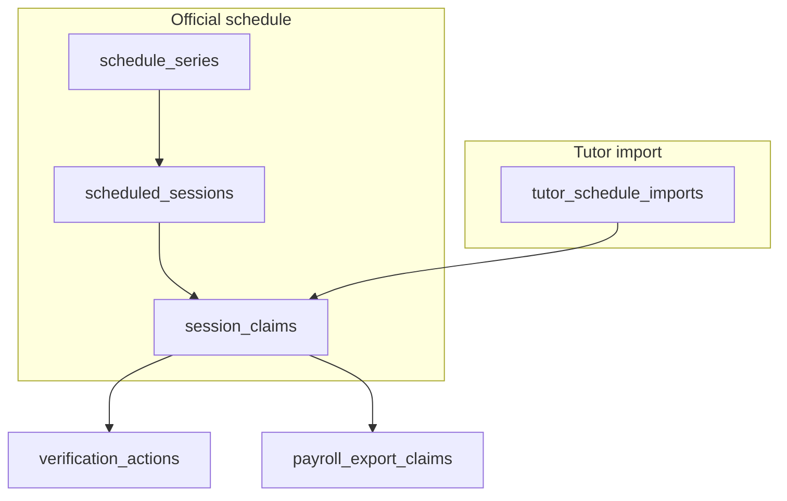
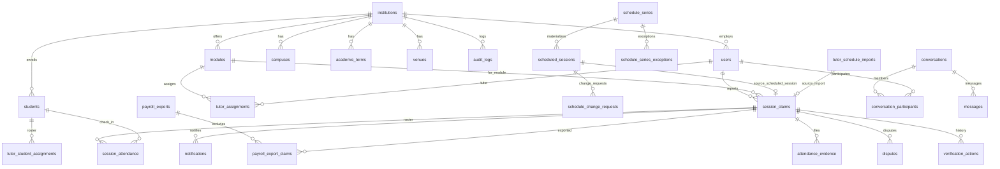
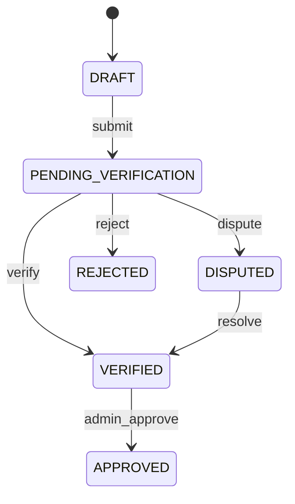

# Database schema

Postgres schema managed by **Supabase** migrations in [`supabase/migrations/`](../supabase/migrations/). The app uses **Row Level Security (RLS)** on almost all `public` tables; server actions use a cookie-scoped Supabase client, with the **service role** only where Auth admin APIs or invite validation require it.

See also: [ARCHITECTURE.md](./ARCHITECTURE.md) for how the application uses this data.

---

## Table of contents

1. [Overview](#1-overview)
2. [Entity relationship diagram](#2-entity-relationship-diagram)
3. [Enums](#3-enums)
4. [Tables by domain](#4-tables-by-domain)
5. [Central table: session_claims](#5-central-table-session_claims)
6. [Scheduling model](#6-scheduling-model)
7. [RLS and security helpers](#7-rls-and-security-helpers)
8. [Triggers and audit](#8-triggers-and-audit)
9. [Storage buckets](#9-storage-buckets)
10. [Migration history](#10-migration-history)
11. [Working with the schema](#11-working-with-the-schema)

---

## 1. Overview

### Tenancy

Every staff user belongs to one **`institutions`** row via **`users.institution_id`**. Most business data is scoped through:

- Direct `institution_id` column (e.g. `venues`, `students`, `audit_logs`)
- **`modules.institution_id`** (claims, series, scheduled sessions)
- Join helpers in RLS (`get_auth_user_institution_id()`, `is_module_in_auth_institution()`)

There is no multi-institution user in the current schema.

### Auth linkage

| Store | Purpose |
|-------|---------|
| `auth.users` | Supabase Auth identities (email, password, MFA) |
| `public.users` | App profile: `id` = `auth.users.id`, role, institution, approval |

Students are **`public.students`** directory rows; they are **not** `auth.users` unless linked by email for a future role.

### Two paths into session claims



---

## 2. Entity relationship diagram



---

## 3. Enums

### Core workflow

| Enum | Values | Used on |
|------|--------|---------|
| `user_role` | `TUTOR`, `LECTURER`, `ADMIN`, `SUPER_ADMIN` | `users.role` |
| `claim_status` | `DRAFT`, `PENDING_VERIFICATION`, `DISPUTED`, `REJECTED`, `VERIFIED`, `APPROVED` | `session_claims.status`, `verification_actions` |
| `dispute_status` | `OPEN`, `RESOLVED`, `CLOSED` | `disputes.status` |
| `user_approval_status` | `pending_documents`, `pending_review`, `approved`, `rejected` | `users.approval_status` |

### Payroll and notifications

| Enum | Values | Used on |
|------|--------|---------|
| `payroll_export_status` | `PENDING`, `GENERATED`, `EXPORTED` | `payroll_exports.status` |
| `notification_channel` | `IN_APP`, `EMAIL`, `SMS` | `notifications.channel` |
| `notification_type` | `CLAIM_*`, `SYSTEM`, `SCHEDULE_CHANGE_*` | `notifications.type` |

### Scheduling

| Enum | Values | Used on |
|------|--------|---------|
| `schedule_series_status` | `DRAFT`, `PUBLISHED`, `ARCHIVED` | `schedule_series.status` |
| `scheduled_session_status` | `SCHEDULED`, `CANCELLED`, `RESCHEDULED` | `scheduled_sessions.status` |
| `schedule_series_exception_action` | `CANCEL`, `OVERRIDE` | `schedule_series_exceptions.action` |
| `schedule_change_request_status` | `PENDING`, `APPROVED`, `REJECTED` | `schedule_change_requests.status` |

### Attendance and messaging

| Enum | Values | Used on |
|------|--------|---------|
| `attendance_status` | `PRESENT`, `LATE`, `ABSENT`, `EXCUSED` | `session_attendance.status` |
| `conversation_type` | `DIRECT`, `GROUP`, `SESSION`, `CLAIM`, `ATTENDANCE` | `conversations.type` |

---

## 4. Tables by domain

### Institution and identity

| Table | Purpose | Key columns |
|-------|---------|-------------|
| `institutions` | Tenant root | `name`, `domain`, `plan_tier`, `scheduling_settings` (jsonb) |
| `users` | Staff profiles | `id` → auth, `institution_id`, `role`, `approval_status`, `mfa_enabled` |
| `user_preferences` | UI/notification prefs | `user_id`, json preferences |
| `user_registration_invites` | Invite-only signup | `email`, `role`, `code_hash`, `expires_at`, `used_at` |
| `user_onboarding_documents` | KYC uploads | `document_kind`, `storage_path` |
| `mfa_events` | MFA audit | `event_type`, `method`, `status` |

### Academic structure

| Table | Purpose | Key columns |
|-------|---------|-------------|
| `campuses` | Physical sites | `institution_id`, `name`, `code` |
| `academic_terms` | Semester/year windows | `label`, `academic_year`, `start_date`, `end_date`, `is_current` |
| `modules` | Courses | `institution_id`, `lecturer_id`, `code`, `name`, `academic_term_id` |
| `tutor_assignments` | Tutor ↔ module | `module_id`, `tutor_id`, `start_date`, `end_date`, `is_active` |

### Session claims workflow

| Table | Purpose | Key columns |
|-------|---------|-------------|
| `session_claims` | **Central business object** | See [§5](#5-central-table-session_claims) |
| `verification_actions` | Status transition log | `claim_id`, `actor_id`, `action_type`, `from_status`, `to_status` |
| `disputes` | Claim disputes | `claim_id`, `reason`, `status`, `resolution_note` |
| `attendance_evidence` | Register file metadata | `claim_id`, `file_url`, `original_filename` |

### Scheduling (official)

| Table | Purpose | Key columns |
|-------|---------|-------------|
| `venues` | Rooms/spaces | `institution_id`, `campus_id`, `name`, `capacity` |
| `schedule_series` | Recurring rule | `module_id`, `tutor_id`, `recurrence_json`, `status`, `dtstart`, `duration_minutes` |
| `scheduled_sessions` | Occurrences | `series_id`, `starts_at`, `ends_at`, `status` |
| `schedule_series_exceptions` | Per-occurrence override/cancel | `occurrence_starts_at`, `action`, override fields |
| `schedule_change_requests` | Tutor-proposed moves | `scheduled_session_id`, `proposed_*`, `status` |

### Tutor timetable import

| Table | Purpose | Key columns |
|-------|---------|-------------|
| `tutor_schedule_imports` | Parsed spreadsheet | `tutor_id`, `file_name`, `parse_result` (jsonb) |

### Students and attendance

| Table | Purpose | Key columns |
|-------|---------|-------------|
| `students` | Institution directory | `institution_id`, `full_name`, `student_reference`, `email` |
| `tutor_student_assignments` | Tutor roster | `tutor_id`, `student_id` |
| `session_attendance` | Per-claim check-ins | `session_id` → claim, `student_id`, `status`, `check_in_time` |

Unique: `(session_id, student_id)` on `session_attendance`.  
Unique: `(institution_id, student_reference)` where reference is set (migration `20260611120000`).

### Payroll

| Table | Purpose | Key columns |
|-------|---------|-------------|
| `payroll_exports` | Export batch | `institution_id`, `period_start`, `period_end`, `total_hours`, `file_url` |
| `payroll_export_claims` | Junction | `export_id`, `claim_id` |

### Messaging

| Table | Purpose | Key columns |
|-------|---------|-------------|
| `conversations` | Thread | `institution_id`, `type`, `metadata` (jsonb) |
| `conversation_participants` | Membership | PK `(conversation_id, user_id)`, `last_read_at`, `is_pinned` |
| `messages` | Content | `conversation_id`, `sender_id`, `content`, `parent_message_id` |
| `message_attachments` | File refs | Linked to messages |

### Notifications and audit

| Table | Purpose | Key columns |
|-------|---------|-------------|
| `notifications` | In-app/email queue | `recipient_id`, `claim_id`, `type`, `is_read` |
| `audit_logs` | Institution events | `institution_id`, `entity_type`, `entity_id`, `event`, `payload` |

---

## 5. Central table: session_claims

`session_claims` is the hub for tutor-reported teaching sessions.

### Core columns (baseline)

| Column | Type | Notes |
|--------|------|-------|
| `id` | uuid | PK |
| `tutor_id` | uuid | FK → `users` |
| `module_id` | uuid | FK → `modules` |
| `session_date` | date | Calendar day |
| `start_time`, `end_time` | time | Local session bounds |
| `hours` | numeric(5,2) | Claimed duration |
| `venue` | varchar | Free text |
| `status` | claim_status | Default `DRAFT` |
| `notes` | text | General notes |
| `submitted_at` | timestamp | When submitted for verification |
| `updated_at` | timestamp | Auto-updated |

### Extensions (later migrations)

| Column | Source | Purpose |
|--------|--------|---------|
| `topics_covered`, `coverage_validated_at` | session notes | Structured coverage |
| `examples_used`, `student_struggles`, `revision_topics` | structured notes | Tutor reflection fields |
| `source_schedule_import_id`, `source_event_fingerprint`, `session_kind` | schedule link | Dedup from Excel import |
| `source_scheduled_session_id` | lecturer schedule | Link to official occurrence |
| `student_id` | students | Optional single-student claim |
| `qr_token`, `qr_expires_at` | attendance | Public check-in token |
| `attendance_present_count`, `attendance_expected_count` | workspace | Cached headcounts |
| `frozen_at` | admin approvals | Blocks status changes when set |

### Uniqueness constraints

| Index | Rule |
|-------|------|
| `idx_session_claims_import_event_unique` | One claim per tutor + import + fingerprint |
| `idx_session_claims_scheduled_session_unique` | One claim per tutor + scheduled session |

### Status flow



Logged in **`verification_actions`**; optional **`disputes`** row while disputed.

---

## 6. Scheduling model

### schedule_series

Recurring template owned by the module lecturer (or admin).

| Field | Description |
|-------|-------------|
| `recurrence_json` | Weekly pattern: `{ frequency, byWeekday[], until }` |
| `status` | `DRAFT` → publish → `PUBLISHED`; archive → `ARCHIVED` |
| `institution_id`, `academic_term_id` | Admin scoping and term filters |
| `dtstart`, `duration_minutes`, `timezone` | First occurrence anchor |

Publishing **materializes** rows in `scheduled_sessions` and typically creates/links **`session_claims`** via app logic (`ensureClaimForScheduledSession`).

### scheduled_sessions

| Field | Description |
|-------|-------------|
| `starts_at`, `ends_at` | Timestamptz bounds |
| `status` | `SCHEDULED` (active), `CANCELLED`, `RESCHEDULED` |
| `original_starts_at` | Preserved when rescheduled |

Unique: `(series_id, starts_at)`.

Conflict indexes (admin engine): tutor time range and venue time for `SCHEDULED` rows.

### Lifecycle (app-level)

| Action | DB effect |
|--------|-----------|
| Delete draft series | `DELETE` from `schedule_series` (cascades sessions) |
| Archive published series | `status = ARCHIVED`; upcoming `SCHEDULED` → `CANCELLED` |

---

## 7. RLS and security helpers

RLS is **enabled** on application tables. Policies are role- and institution-scoped; many use **SECURITY DEFINER** helpers to avoid recursive policy graphs.

### Common helper functions

| Function | Purpose |
|----------|---------|
| `get_auth_user_institution_id()` | Current user's `institution_id` |
| `get_auth_user_role()` | Current user's `role` |
| `auth_user_is_admin()` | Admin or super admin |
| `auth_user_has_role(role)` | Role check |
| `is_module_in_auth_institution(module_id)` | Module belongs to user's institution |
| `is_lecturer_for_module(module_id)` | User owns module as lecturer |
| `is_lecturer_for_claim(claim_id)` | Lecturer owns claim's module |
| `is_lecturer_for_series(series_id)` | Lecturer owns series' module |
| `is_series_in_auth_institution(series_id)` | Admin institution scope |
| `is_conversation_participant(conv_id)` | Messaging membership (no RLS recursion) |
| `get_auth_user_approval_status()` | Onboarding gate |

Defined across migrations; central fixes in `20260517120000_fix_rls_recursion.sql`.

### Typical access patterns

| Actor | session_claims | schedule_series | students |
|-------|----------------|-----------------|----------|
| **Tutor** | Own rows: select/insert/update | Select published where `tutor_id = self` | Limited insert/select via roster |
| **Lecturer** | Module-scoped via `is_lecturer_for_*` | Full CRUD on own modules | Institution-scoped read |
| **Admin** | Institution via `is_module_in_auth_institution` | Insert/update/delete in institution | Institution CRUD |

**`user_registration_invites`**: RLS enabled with **no client policies** — server-only via service role.

### Service role usage

The app uses the service role for operations that bypass RLS safely in server code, for example:

- Invite validation at signup
- Some QR check-in paths
- Privileged user provisioning

Prefer the user-scoped client whenever RLS policies already express the rule.

---

## 8. Triggers and audit

| Trigger / function | Table | Behavior |
|--------------------|-------|----------|
| `log_claim_status_change()` | `session_claims` | On `status` change → insert `audit_logs` (`STATUS_CHANGED`) |
| `update_updated_at_column()` | Various | Sets `updated_at` on update |
| `rls_auto_enable` | DDL event | Auto-enables RLS on new `public` tables |

Admin actions may also call `logInstitutionAudit()` from application code (`src/lib/audit-log.ts`) for schedule and user events.

---

## 9. Storage buckets

| Bucket | Public | Typical path pattern | Purpose |
|--------|--------|----------------------|---------|
| `attendance_registers` | No | `{tutor_id}/{claim_id}/...` | Session register uploads |
| `avatars` | Yes | User-owned | Profile photos |
| Onboarding / messaging | Per migration | Varies | Documents, message attachments |

Storage policies mirror table RLS: tutors own their register paths; lecturers/admins get read policies on evidence paths.

Metadata for registers is also stored in **`attendance_evidence`** (`file_url` points to storage).

---

## 10. Migration history

Migrations apply **in filename order**. Grouped by theme:

| Period / file prefix | Theme |
|----------------------|--------|
| `20260513041400_remote_schema` | Baseline: institutions, users, modules, session_claims, payroll, audit, notifications |
| `20260513120000` – `20260513150000` | Session notes, tutor schedule imports |
| `20260514120000` | Students, tutor_student_assignments |
| `20260515120000` | Claims ↔ import fingerprint |
| `20260516120000` | Tutor workspace RLS, attendance counts, register bucket |
| `20260517120000` | RLS recursion fixes (institution helpers) |
| `20260518120000` | QR tokens, session_attendance |
| `20260519120000` – `20260531140000` | Messaging system + enhancements |
| `20260520120000` | Structured session notes columns |
| `20260521120000` | user_preferences, avatars bucket |
| `20260522120000` – `20260529120000` | Signup RLS, lecturer/tutor institution fixes |
| `20260523120000` – `20260525120000` | Lecturer claims and verification workflow |
| `20260526120000` | **Scheduling system** (venues, series, sessions, exceptions, change requests) |
| `20260527120000` – `20260531120000` | Lecturer tutors, messaging RLS fixes |
| `20260601120000` – `20260601140000` | Admin institution RLS, approvals writes, campuses, terms |
| `20260602140000` – `20260602150000` | User onboarding, approval status, self-update RLS |
| `20260603120000` | **Admin scheduling engine** (term linkage, conflict indexes, admin series RLS) |
| `20260604120000` – `20260611120000` | Admin sessions support, student reference unique |
| `20260606120000` – `20260610120000` | Audit logs feed, verification actor FK, admin claim insert |

To apply locally:

```bash
npx supabase db reset    # if using local Supabase CLI
# or push migrations to linked project
npx supabase db push
```

---

## 11. Working with the schema

### Where logic lives

| Need | Location |
|------|----------|
| Queries and mutations | `src/server-actions/<domain>/` |
| Shared DB clients | `src/lib/supabase-server.ts`, `supabase-admin.ts` |
| Schedule materialization | `src/server-actions/lecturer-schedule/materialize-series.ts` |
| Conflict detection | `src/lib/schedule-conflicts.ts` (reads sessions, not SQL) |

Do not embed business rules only in the client; RLS alone is not sufficient for validations (status transitions, archive rules, etc.).

### Adding a migration

1. Create `supabase/migrations/YYYYMMDDHHMMSS_description.sql`.
2. Use `IF NOT EXISTS` / `DROP POLICY IF EXISTS` for idempotency where the project already does.
3. Enable RLS and add policies for each role that needs access.
4. Grant `authenticated` (and `service_role` if needed) explicitly.
5. Regenerate types if the project uses generated Supabase types (check local workflow).

### ER ↔ app DTOs

Server actions return **DTOs** mapped in `*/mappers.ts` or inline — not raw table rows. When documenting or debugging, trace from UI → `*Fn` handler → Supabase `.select(...)` → table/column.

---

## Related documentation

- [ARCHITECTURE.md](./ARCHITECTURE.md) — application layers, routes, features by dashboard
- [Supabase migrations](../supabase/migrations/) — source of truth for columns and policies
